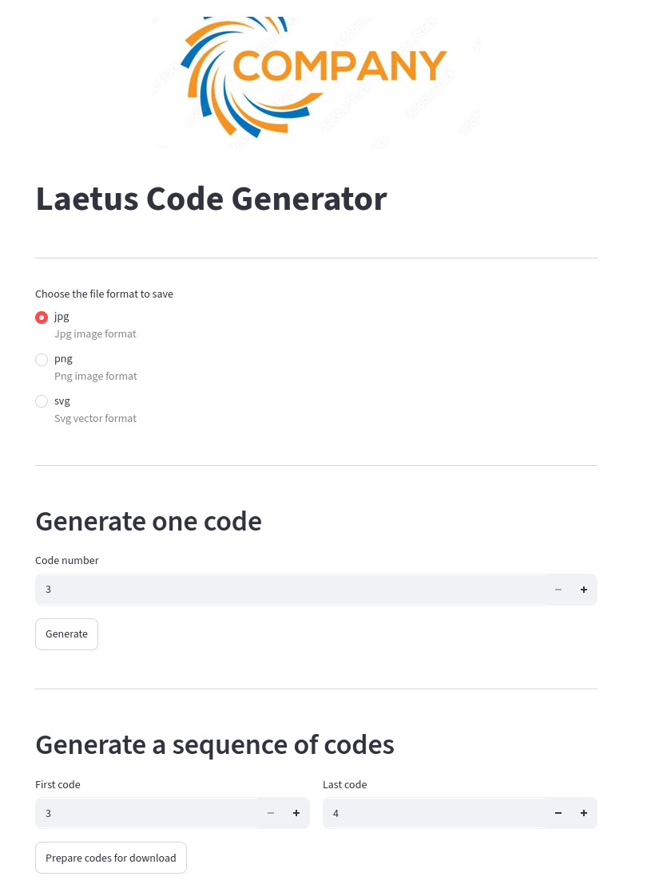

# Laetus (Pharma) Code Generator v2.0

A Python application for generating **Laetus (Pharmacode)** barcodes used in the pharmaceutical industry. The application provides a simple web interface built with Streamlit and runs entirely inside a Docker container.

---

## Why this project?

The first version of this application (v1.0) was developed to solve an immediate production requirement: generating large batches of Laetus codes quickly and reliably.

While functional, version 1 had several limitations:

* barcode images could only be saved as **JPEG**
* files were written directly to disk
* no vector output was available
* the application consisted of two separate implementations

Version **2.0** is a complete redesign of the project. The generation engine has been rewritten to be more modular and reusable, while the user interface has been simplified.

---

## What's New in v2.0

* Support for **three output formats**

  * JPG
  * PNG (transparent background)
  * SVG (vector format)

* Direct browser download

  * Files are generated entirely in memory.
  * No temporary files are created on the server.

* Single barcode generation

* Batch generation

  * Generate any interval of valid Laetus codes.
  * Download all generated files as a ZIP archive.

* Docker deployment

  * No Python installation required on the client machine.

* Improved project architecture

  * Clear separation between the barcode generation engine and the Streamlit frontend.
  * Reusable `LaetusCode` class.

---

## Features

* Correct implementation of the Laetus encoding algorithm
* Generates codes from **3** to **131070**
* Vector SVG output suitable for Adobe Illustrator and professional printing workflows
* High-resolution JPG and PNG generation
* ZIP archive creation entirely in memory using `BytesIO`
* Simple and intuitive Streamlit interface
* Fully containerized with Docker

---

## Tech Stack

* Python
* Streamlit
* Pillow
* svgwrite
* Docker
* Docker Compose

---

## Project Structure

```text
project/
│
├── app.py                 # Streamlit application
├── code_generator.py      # LaetusCode class
├── company_logo.jpg
├── requirements.txt
├── Dockerfile
├── docker-compose.yml
└── README.md
```

---

## Installation

Clone the repository:

```bash
git clone https://github.com/luciandtanalyst/pharmacodegenerator.git
```

Enter the project directory:

```bash
cd pharmacodegenerator
```

Start the application:

```bash
docker compose up -d
```

Open your browser:

```
http://localhost:8503
```

## 👀 Preview



---

## Usage

### Generate a single barcode

1. Select the output format.
2. Enter a valid Laetus code.
3. Preview the generated barcode.
4. Download the generated file.

### Generate multiple barcodes

1. Select the output format.
2. Enter the first and last code.
3. Generate the archive.
4. Download the ZIP file.

---

## Supported Formats

| Format | Description                                        |
| ------ | -------------------------------------------------- |
| JPG    | Standard raster image                              |
| PNG    | Raster image with transparent background           |
| SVG    | Vector graphics suitable for professional printing |

---

## Custom Branding

To customize the application:

Replace the file

```
company_logo.jpg
```

with your own company logo while keeping the same filename.

---

## Roadmap

* [ ] Command Line Interface (CLI)
* [ ] Stand-alone Windows executable
* [ ] PDF export
* [ ] EPS export
* [ ] Adjustable barcode dimensions
* [ ] Custom font selection
* [ ] REST API version

---

## Disclaimer

Although the encoding algorithm has been implemented according to the Laetus specification, every generated barcode should be verified before being used in pharmaceutical production.
